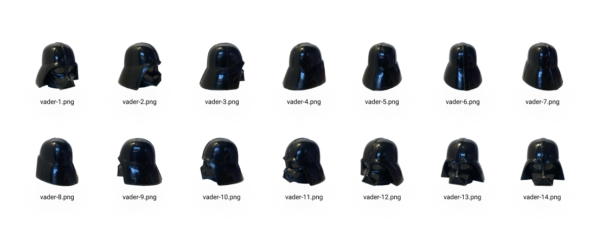

# Image 360 Viewer

People want to see all the details of a product before they buy it. Being able to view and explore the product gives the user a trusted experience and connects the user with the product. There are cases where a static image cannot demonstrate all the details of the product. 

The `Image360Viewer` has support for `React Native CLI` and `Expo`. This library allows the user to explore and have the freedom to view all product details in 360 degrees.


Image360Viewer loads a sequence of images that rotates with a user touch interaction.




## 🗺 Getting started
Install the library using:

```sh
yarn add image360viewer
```


_Image360Viewer requires that you install [`react-native-svg`](https://github.com/react-native-svg/react-native-svg)._


## 🎉 Usage

```ts
import { Image360viewer } from 'image360viewer';

export default function App() {
  return (
    <Image360viewer
      images={images360}
      width={300}
      cursorIcon={<Image source={directionsImg} style={styles.icon} />}
    />
  )
}
```


## 📘 Properties

Image360viewer has the following properties:

| Property                       | Description                               |
| :-----------                   | :----------                               |
| `height?: number`              | Image height default is 250.              |
| `width?: number`               | Image width default is 250.               |
| `images?: ImageProps[]`        | Vector images to rotate.                 |
| `resizeMode?: ImageResizeMode` | Image display mode. Default is contain.   |
| `rotationRatio?: number`       | The drag distance compares to 180 degree. |
| `cursorSize?: number`          | Text                                      |
| `cursorIcon?: ReactNode`       | Content or icon.                          |


## 📱 Demo
View a demo at Expo Web:


## 👏 Contributing 

Obrigado por estar interessado em tornar este pacote melhor. Encorajamos todos a ajudar a melhorar este projeto com novos recursos, correções de bugs e melhorias de desempenho.


## 💜 License

MIT License © [Rodrigo Gonçalves](https://github.com/rodrigorgtic)


[](https://www.linkedin.com/in/rodrigo-gon%C3%A7alves-santana/) 
[](https://www.instagram.com/rodrigo.goncalves.s/) 
[](https://twitter.com/rodrigogsdev) 
